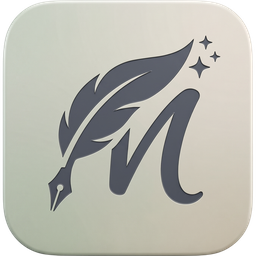

<p align="center">
  
</p>

<h1 align="center">Memoire</h1>

<p align="center">Writing at the speed of thought.</p>

Memoire is a local-first, privacy-focused writing and knowledge management app.
Your notes, files, and ideas live on your machine. An integrated assistant,
powered by a local large language model (LLM), lets you interrogate your own
writing without sending a word to the cloud.

## Features

- **Distraction-free canvas** — the smallest surface area we could defend; every panel earns its place.
- **Command palette** — type a colon, run anything.
- **Branching undo tree** — history that branches instead of collapsing into a straight line.
- **Local or hosted models** — run on-device, or point at a hosted model when you want one.
- **Assistant that waits to be asked** — suggestions you accept, or don't.
- **Binders & live outline** — structure long work, manuscript-ready in one sheet.
- **Goals, not streaks** — progress tracking without the guilt loop.
- **Git sync** — point at a GitHub repo; every save becomes a commit you own.
- **Export anywhere** — manuscript formats, no lock-in.

## Install

Grab the latest macOS build from [Releases](https://github.com/Riley1101/memorie/releases).

## Development

```sh
bun install
bun run tauri dev      # run the desktop app
bun run tauri build    # produce a release bundle
```

## Sample config

```yaml
content_directory: '~/.memorie/notes'
undotree_dir: '~/.memorie/.history'
default_llm_model: 'qwen_2_5_0_5b_instruct'
```

## Status

Version 0.1.0 — first release. Expect rough edges.

## Roadmap

Dropbox sync, a mobile companion, and margin notes & review are planned.
A plugin API is being explored.
